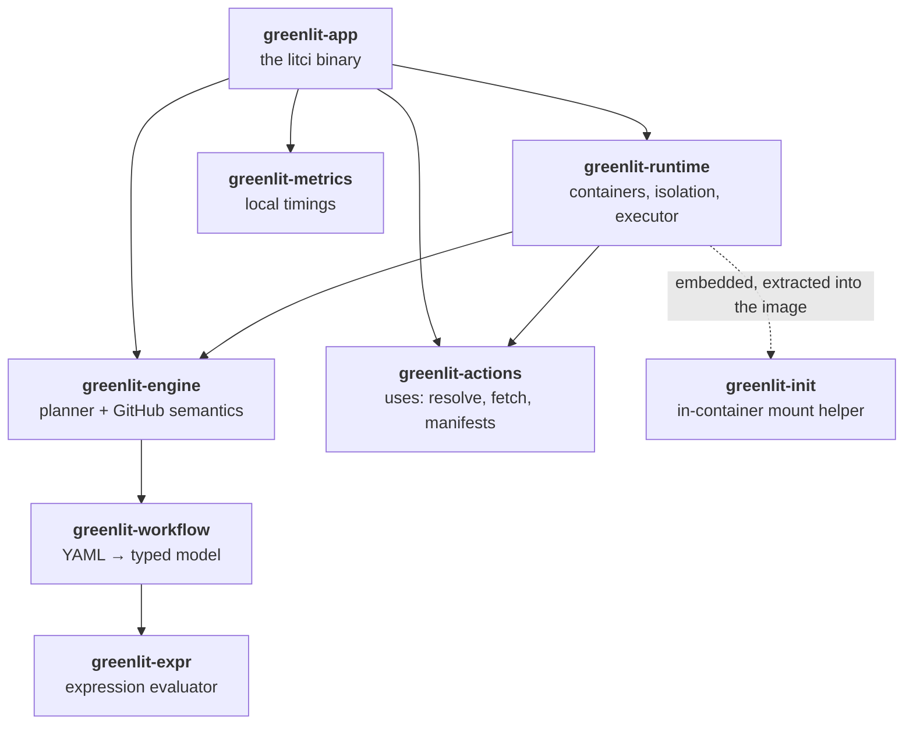

<div align="center">

# Greenlit

**Run your GitHub Actions workflows locally, fast, with results you can trust.**

*Green locally means green on GitHub.*

[](https://github.com/KanterLabs/greenlit-app/actions/workflows/ci.yml)
[](LICENSE)
[](rust-toolchain.toml)
[](#requirements)
[](#where-it-is-today)

</div>

---

## You can't run GitHub Actions locally

So debugging CI looks like this: push, wait five to fifteen minutes, read the logs, change one line, push again. A typo in a `${{ }}` expression costs you a coffee break.

`act` exists, and people use it, and they still don't trust it — because it's an approximation. No `vars` context. An incomplete `github` context. No cache emulation, so every run redownloads the world. Service containers that work until they don't. You get a result, then you push anyway to find out what GitHub *actually* thinks.

Greenlit is built around one claim instead: **if it passes here, it passes on GitHub.** Every engine decision serves that. Where GitHub's behavior is ambiguous, the code cites the docs section or an observed run that pins it. Where something isn't supported, you get an error with a file, a line, a column, and the one action that fixes it — never a mysterious pass.

## Quick start

Greenlit is pre-release: there's no published crate or binary yet, so you build it.

```bash
git clone https://github.com/KanterLabs/greenlit-app.git
cd greenlit-app
cargo build --release -p greenlit-app     # produces target/release/litci
install -m755 target/release/litci ~/.local/bin/
```

Then, in any repository with a workflow:

```bash
litci setup      # only if you don't have Docker or Podman yet
litci run        # that's it — no flags, no image selection, no config file
```

No setup file. No image to pick. `litci run` finds your workflow, plans it, and runs it.

## See it run

A three-job workflow — env layering, output propagation through `$GITHUB_OUTPUT` and `$GITHUB_ENV`, a `continue-on-error` step, `if: failure()` and `if: always()` gating, a custom job container, and a `needs:` consumer — start to finish:

```console
$ litci run

Greenlit  000000000000000018c5e1a7f6f03fc8-000a4c3c-0000
  source snapshot    finished  sha256:888abf...
  actions            finished  3 locked
  runners            finished  1 locked

job build
  OK     env layering  282ms
  OK     grouped output  1.2s
  OK     generate output  251ms
  - only on failure  step condition or implicit status gate evaluated false
  OK     cleanup always runs  96ms

job report
  OK     consume the dependency output  143ms

OK Passed locally - degraded compatibility
  evidence: 000000000000000018c5e1a7f6f03fc8-000a4c3c-0000 (Passed/Degraded/Local)
  logs:     litci logs 000000000000000018c5e1a7f6f03fc8-000a4c3c-0000
```

Compact mode is intentionally quiet: successful step bodies are retained,
not discarded. Use `litci logs [RUN_ID]`, add `--job`/`--step`/`--tail` to
narrow the replay, or run with `--log-mode full` when you want every line
live. `litci run --format jsonl` and `litci logs --format jsonl` expose the
same schema-versioned records stored with the run evidence.

Every stage is timed, every run appends one record to a local file, and `litci stats` shows the trend. That data never leaves your machine — see [Your machine, your data](#your-machine-your-data).

### Look before you leap

`litci plan` answers "what would run, and with what values?" without starting a single container or touching the network. Every value is marked either as resolved-now or as deliberately deferred to runtime, with the reason (abridged — the real output prints every field of every step):

```console
$ litci plan
plan schema: 1
event: push
run name: (event default)
env:
  WORKFLOW_LEVEL: static("wf") <- wf
defaults.run: (none)
permissions: (GitHub default)
topo order: build -> container-job -> report

jobs:
  build [wave 0] needs: (none)
    id: build
    name: static("build") <- build
    permissions: (GitHub default)
    runner: static(ubuntu-24.04) <- ubuntu-latest
    container: (none)
    services: (none)
    env:
      JOB_LEVEL: static("job") <- job
    defaults.run: (none)
    if: (none) -- implicit success() gate
    outputs:
      version: deferred <- steps.gen.outputs.version (defers on: steps.gen.outputs.version)
    steps:
      step [id: (none)]
        name: static("env layering") <- env layering
        if: (none) -- implicit success() gate
        kind: run
        …
      step [id: (none)]
        name: static("only on failure") <- only on failure
        if: deferred <- failure() (defers on: failure())
        kind: run
        …
```

`litci plan --json` emits the same thing as a stable, versioned document, so you can diff a plan across a refactor.

### When something isn't supported, you find out immediately

```console
$ litci plan -W fixtures/unsupported-runner.yml
fixtures/unsupported-runner.yml:10:14: unsupported runner 'windows-latest' — v0 supports only: ubuntu-latest, ubuntu-24.04, ubuntu-22.04
  fix: use one of the supported runner labels: ubuntu-latest, ubuntu-24.04, ubuntu-22.04

$ litci plan -W fixtures/workflow-call.yml
fixtures/workflow-call.yml:7:18: workflow_call: not in v0
  fix: remove or restructure the workflow to avoid this construct -- it is out of scope for Greenlit v0
```

Not a silent skip. Not a confusing failure forty seconds into a container boot. A location and a fix, before anything starts.

## Why it's different

**Fidelity.** The `${{ }}` evaluator is complete: `github`, `env`, `secrets`, `vars`, `needs`, `matrix`, `strategy`, `steps`, `runner`, `job`, and `inputs` contexts, every built-in function, and string coercion and comparison pinned to .NET's exact semantics — because that's what the real runner uses. `hashFiles` genuinely hashes files, with the runner's own glob semantics. Steps within a job run sequentially and are never skipped or result-cached, because that would break the only claim that matters.

**Zero config.** `litci run` works in any repo with no flags, no image selection, and no setup file. If several workflows are candidates, it asks with an arrow-key picker instead of erroring at you — but only when you're at a terminal, so scripts and CI keep the explicit error.

**Contained by default.** Running marketplace actions means executing someone else's code on your laptop. Nothing an action does can touch your host. This is not configurable off.

**Fast by default.** Async orchestration on tokio, actions content-addressed by commit SHA so a pinned action is fetched exactly once ever, and Node runtimes cached across every repo on your machine.

## Contained by default

`act` bind-mounts your working tree into the container and can hand actions the host Docker socket — a malicious or compromised action gets your files and, through the socket, effectively root on your machine. Greenlit inverts every one of those:

- **Your working tree is read-only.** The repo is mounted read-only and a throwaway overlay is stacked on top. The container sees a normal writable checkout; every write lands in a scratch layer that's discarded. Actions cannot modify or plant files in your tree, and there's no copy cost even on a huge repo. If you *want* the changes, `--write-back` exports the diff, lists every changed path, and applies it only after you confirm.
- **The host Docker socket is never mounted.** Not into workflow containers, not into service containers, not into Docker actions — which run as isolated siblings sharing only a run-scoped volume. Container inspection is an invariant test, not a promise.
- **Secrets are masked before the first step runs.** Every value from every source in the resolution chain registers with the masker before any container starts, so a secret can't leak through the one log line written before setup finished. `.litci/secrets` is created `0600`, and `.litci/` is added to your `.gitignore` automatically.
- **Untrusted repository content stays bounded.** YAML alias, nesting, and node-count limits; `hashFiles` traversal pinned beneath its workspace root and re-resolved at every hop so a symlink can't walk it out; a bounded alias registry so a hostile directory graph can't exhaust host memory.

## The commands

```
litci run    [-e EVENT] [-W FILE] [-j JOB] [--var K=V] [--input K=V] [-s K=V]
             [--isolation auto|overlay|copy-in] [--write-back] [--no-input]
             [--clean] [--hermetic] [--offline] [--no-daemon]
             [--format plain|jsonl] [--log-mode compact|full]
             [--color auto|always|never]
litci plan   [--json] [-e EVENT] [-W FILE] [--var K=V] [--input K=V]
litci export [RUN_ID] [--output DIRECTORY]
litci confirm RUN_ID --repository OWNER/REPO --github-run ID
litci setup  [-y]
litci auth   [--pat | --gh]
litci stats
litci inspect [RUN_ID]
litci logs [RUN_ID] [--job ID] [--step ID] [--tail N] [--follow]
           [--format plain|jsonl]
litci doctor [--json]
litci clean [-y]
```

**`run`** is the habit command; everything else is occasional. `-j` runs one job and its transitive `needs:`. `-e` simulates `push`, `pull_request`, or `workflow_dispatch`.

**`plan`** resolves everything it can without containers or network, and `--json` makes that output diffable.

**`export`** writes a separate, fully pinned GitHub workflow and
`greenlit-evidence-v1.json`. It never edits your workflows, commits, pushes,
dispatches, or sends a message. Commit and trigger that separate file through
your ordinary review process. The safe first-use sequence is: export, add the
separate workflow to the commit you intend to test, rerun Greenlit at that
clean commit, export that new run, verify the workflow file is unchanged, and
then push or dispatch it. The evidence job fills in GitHub's actual commit at
runtime, so the exported workflow has no self-referential commit hash.

**`confirm`** performs read-only GitHub API calls. It upgrades an eligible
hermetic result only after the source, event and inputs, pinned workflow bytes,
actions, containers, toolchains, expanded jobs and steps, successful
conclusions, and downloaded artifact digest all match. A GitHub pass with any
mismatch is reported only as an observed pass.

**`setup`** handles the container engine. Detection is three-state — reachable, installed but stopped, or absent — and each state maps to one action. Greenlit never shows you "cannot connect to Docker daemon".

**`auth`** signs you in through GitHub App device flow for repository variable lookup and action resolution. The token is read-only and stored in your kernel keyring. `--pat` pastes a fine-grained token instead; `--gh` borrows the GitHub CLI's, with a warning about its broader scope.

**`stats`** shows recent invocations and per-stage timing trends from your local records.

### Secrets and variables

Both resolve through an explicit chain, and Greenlit statically finds every `secrets.*` and `vars.*` reference in your workflow *before* the run starts — so you're prompted up front, not forty seconds in.

```bash
litci run -s API_TOKEN=xxx        # CLI, then process env, then .litci/secrets, then a prompt
litci run --var TARGET=staging    # CLI, then process env, then .litci/vars, then GitHub
```

Variables fall through to your real repository and organization variables once you've run `litci auth`, with repository values overriding organization ones — exactly as GitHub resolves them.

## How it works

Eight crates, one binary. The planner is pure — it never touches a container — and everything that talks to the engine goes through a single trait, so other platforms are ports rather than rewrites.



And what a `litci run` actually does:

```mermaid
flowchart LR
    subgraph planning["plan — no containers, no network"]
        direction TB
        yaml["workflow YAML"] --> parse["parse<br/><i>span-preserving</i>"]
        parse --> extract["static extraction<br/><i>every secrets. / vars. / uses:</i>"]
        extract --> ctx["resolve contexts<br/><i>CLI → env → .litci → GitHub</i>"]
        git["local git metadata"] --> event["synthetic event"]
        ctx --> plan["plan<br/><i>DAG, matrix, partial evaluation</i>"]
        event --> plan
    end

    subgraph prepare["prepare"]
        direction TB
        detect["detect engine<br/><i>DOCKER_HOST → Docker → Podman</i>"] --> prepass["action pre-pass<br/><i>resolve + fetch before boot</i>"]
        prepass --> image["ensure image"]
        image --> boot["boot job container"]
    end

    subgraph execute["execute"]
        direction TB
        iso["isolate workspace<br/><i>read-only mount + overlay</i>"] --> steps["run steps<br/><i>sequential, never skipped</i>"]
        steps --> outputs["finalize job outputs<br/><i>live needs propagation</i>"]
    end

    plan --> detect
    boot --> iso
    outputs --> record["local<br/>metrics record"]
```



For the full picture — crate boundaries, trust and resource boundaries, and the known-issues log of every upstream quirk being worked around — see [ARCHITECTURE.md](ARCHITECTURE.md).

## Your machine, your data

Every `plan` and `run` appends one record to `~/.litci/metrics/runs.ndjson`: stage durations, step durations, cache hit and miss counters. `litci stats` reads it back.

**That data is never transmitted anywhere. There is no telemetry, and there will not be.** No dependency in the project provides a transport for it, and any code path that would send it off-machine is a defect.

## Where it is today

Greenlit v0 is implementation-complete but **pre-release**: no crate, binary,
container image, dashboard, or launch announcement has been published.

Working now includes full workflow planning and execution; JavaScript,
composite, and Docker actions; services; cache and artifact shims; private
fresh workspaces; immutable RunLocks and JobLocks; a machine-wide verified
CAS; exact offline replay; daemon prefetch and crash recovery; lease-aware
garbage collection; clean and hermetic policies; configured direct
containerd/stargz lazy materialization with a verified eager fallback; and
read-only GitHub confirmation through a separate pinned workflow.

Results deliberately have three independent dimensions: execution,
compatibility, and assurance. A local pass is `local`, `clean`, or `hermetic`
only when its stored evidence qualifies. `github-confirmed` is impossible
without matching external evidence. The default official ARC runner images
are pinned and reusable, but they are self-hosted runner images rather than
the complete GitHub-hosted environment, so Greenlit reports that difference
instead of claiming equivalence.

Warm native-Linux budgets are enforced continuously: sandbox creation p95
below two seconds, a typical warm workflow below 30 seconds, and zero
Greenlit-controlled downloads on an unchanged warm run.

Deliberately out of scope for v0, and rejected at plan time with a location and a fix rather than silently misbehaving: `concurrency`, reusable workflows (`workflow_call`), environments and deployments, OIDC, runner labels other than `ubuntu-latest` / `ubuntu-24.04` / `ubuntu-22.04`, the `cmd` / `powershell` / `pwsh` shells, privileged and host-namespace container options, and macOS, Windows, or non-x86_64 hosts.

## Requirements

- **Linux x86_64.** WSL2 gives Windows users a working path. Other platforms are ports behind the engine trait, not rewrites — but they're not v0.
- **Linux 5.6 or newer**, for the `openat2` resolution flags `hashFiles` uses to stay inside its workspace.
- **Docker or Podman.** Podman works through its Docker-compatible socket. Greenlit speaks the Engine API directly and never shells out to `docker`. If you have neither, `litci setup` installs one after a single confirmation.
- **About 100 MiB downloaded once** the first time you run a JavaScript action, for the pinned runner Node runtimes — cached across every repo afterwards.

One caveat worth knowing: on a stock **rootful** Docker daemon, unprivileged overlayfs inside a container is denied, so runs fall back to copying the checkout in (you'll see it logged, as in the output above) and `--write-back` is unavailable. A rootless daemon gets you the overlay path.

## Building and contributing

```bash
cargo build -p greenlit-app     # the litci binary
cargo test --workspace          # oracle, integration, and invariant tests
```

CI runs these in order, fail-fast — the same gates locally:

```bash
cargo fmt --all -- --check
cargo clippy --workspace --all-targets --all-features -- -D warnings
cargo deny check
python3 tools/check-stubs
cargo test --workspace
RUSTDOCFLAGS="-D warnings" cargo doc --workspace --no-deps
cargo bench --workspace
LITCI_TEST_PERFORMANCE=1 cargo test -p greenlit-app --test performance_budgets -- --nocapture
```

The bar is deliberately high: no `unwrap`/`expect`/`panic!` outside tests, no `#[allow]`, no `TODO` comments, no ignored tests. Every GitHub-matching behavior carries a comment citing the docs section or the observed run that pins it. Tests exist to pin GitHub's behavior and Greenlit's invariants, and nothing else — [TESTING.md](TESTING.md) is blunt about what does *not* get a test and why.

- [AGENTS.md](AGENTS.md) — working rules, quality bar, and phase status
- [greenlit-v0-spec.md](greenlit-v0-spec.md) — the product: principles, scope, security model, fidelity contract
- [ARCHITECTURE.md](ARCHITECTURE.md) — crate boundaries, dataflow, known-issues log
- [TESTING.md](TESTING.md) — what gets tested, and what's banned
- [docs/](docs/) — the ten phase briefs and completed-phase summaries

## License

MIT — see [LICENSE](LICENSE).
